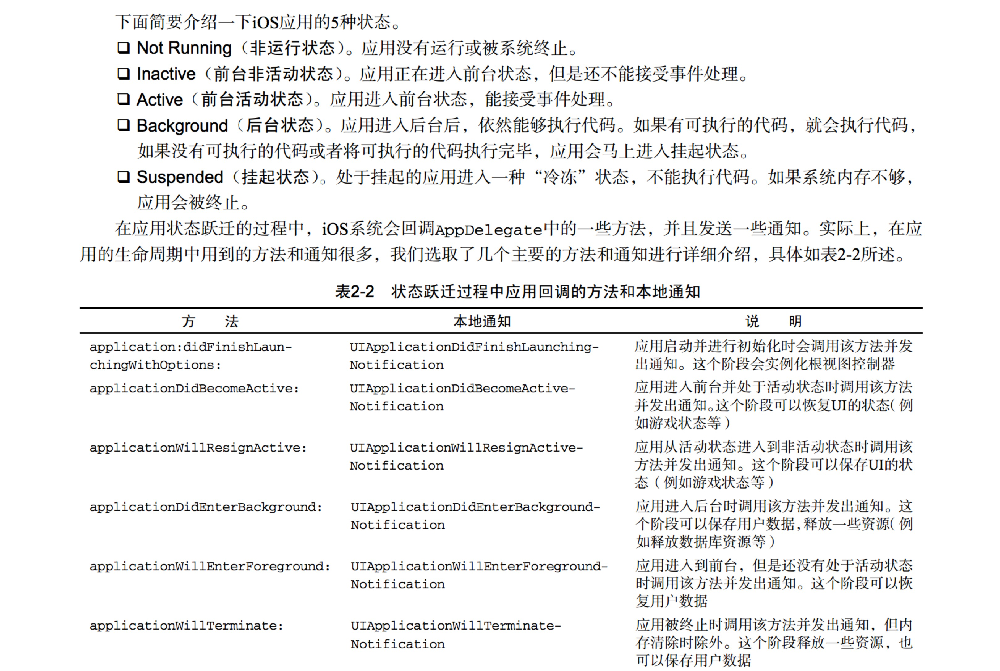
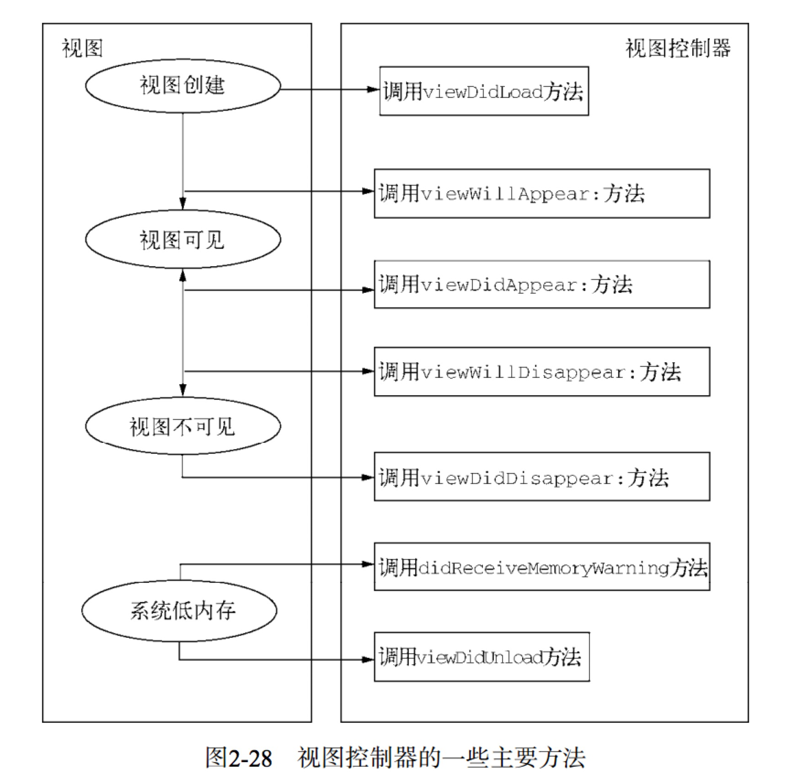

### ios 应用生命周期

如图所示

### ios view 生命周期

如图所示

- viewDidLoad方法在应用运行的时候只调用一次，而这上述4个方法可以被反复调用多次.

- 在低内存情况下，iOS会调用didReceiveMemoryWarning:和viewDidUnload:方法。在iOS6之后，就不再使用viewDidUnload:，而仅支持didReceiveMemoryWarning：。didReceiveMemoryWarning:方法的主要职能是释放内存，包括视图控制器中的一些成员变量和视图的释放。现举例如下：
<pre>
	- (void)didReceiveMemoryWarning { 
		self.button = nil ;
		self.myStringD = nil; 
		[myStringC release]; //ARC内存管理情况下不用
		[super didReceiveMemoryWarning]; 
	} 
</pre>
